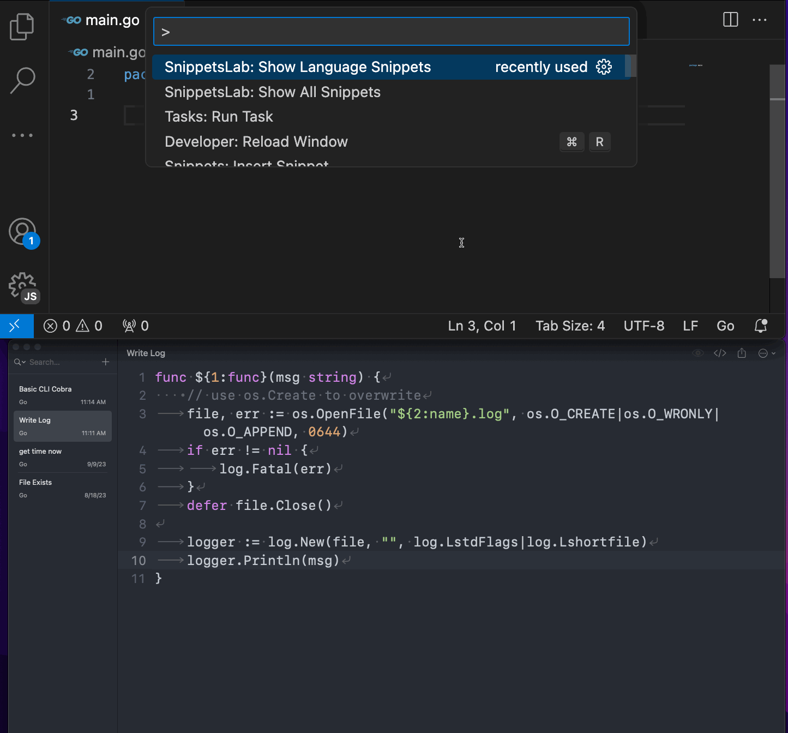

# SnippetsLab

Unofficial SnippetsLab integration for VS Code.

## Description

Access your SnippetsLab snippets directly in VSCode and enjoy full compatibility with native VSCode [snippet syntax](https://code.visualstudio.com/docs/editor/userdefinedsnippets#_snippet-syntax).

## Requirements

- [SnippetsLab](https://www.renfei.org/snippets-lab/) (MacOS only)
- The extensions needs the path of your SnippetsLab backup folder. By default, it is `~/Library/Containers/com.renfei.snippets-lab/Data/Library/Application Support/SnippetsLab`. You can change it in the extension settings.

## Usage

Simply open the command palette and run the `SnippetsLab: Show All Snippets` or `SnippetsLab: Show Language Snippets` command for language specific snippets.

[demo](#demo)

## Ignore Snippets

You can ignore snippets by adding the `vscode-ignore` tag to the snippet in SnippetsLab.

## Available Commands

| Command Name           | Command ID                         | Description                            |
| ---------------------- | ---------------------------------- | -------------------------------------- |
| Show All Snippets      | `snippetslab.showAllSnippets`      | Show all snippets                      |
| Show Language Snippets | `snippetslab.showLanguageSnippets` | Show snippets for the current language |

- By default, the extension does not provide any shortcut. But you can assign each command to one. (see [Key Bindings for Visual Studio Code](https://code.visualstudio.com/docs/getstarted/keybindings) for more information).

Example `keybindings.json` :

```json
[
    {
        "key": "alt+shift+s",
        "command": "snippetslab.showAllSnippets"
    },
    {
        "key": "ctrl+alt+s",
        "command": "snippetslab.showLanguageSnippets"
    },
]
```

## Configuration

- `snippetslab.backupFolder`: Path to your SnippetsLab backup library. Default: `~/Library/Containers/com.renfei.snippets-lab/Data/Library/Application Support/SnippetsLab`

- `snippetslab.searchSnippetsByDescription`: Search snippets by description. Default: `true`

- `snippetslab.searchSnippetsByDetails`: Search snippets by details. Default: `true`

- `snippetslab.copySnippetToClipboard`: Copy snippet to clipboard. Default: `false`

## Notes

The extension uses the latest backup of your SnippetsLab library. If you don't see your latest snippets, please back up your library and restart VS Code.

## Demo

